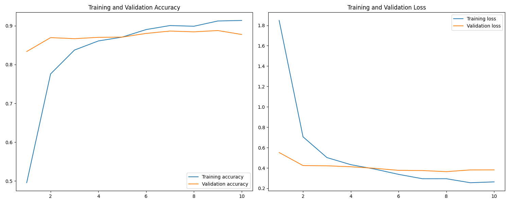

# Pet Face Classification 🐾


End-to-end image classification system for the [Oxford-IIIT Pet Dataset](https://www.robots.ox.ac.uk/~vgg/data/pets/), classifying **37 cat and dog breeds** from raw images using two model architectures: a custom CNN baseline and a ResNet50 transfer learning model.

---

## Table of Contents

- [Results](#results)
- [Project Structure](#project-structure)
- [Dataset](#dataset)
- [Architecture](#architecture)
- [Setup](#setup)
- [Usage](#usage)
- [Configuration](#configuration)
- [Author](#author)

---

## Results

### Model Comparison

| Model | Test Accuracy | Test Loss | Epochs Trained |
|---|---|---|---|
| Custom CNN (baseline) | **21.04%** | 2.858 | 20 |
| ResNet50 (transfer learning) | **88.36%** | 0.369 | 10 |

> The ResNet50 transfer learning model achieves **88.36% test accuracy** in only 10 epochs — a **4× improvement** over the custom CNN baseline — demonstrating the power of pretrained ImageNet features for fine-grained breed classification.

### ResNet50 Training Curves



---

## Project Structure

```text
classification_pet_faces/
├── data/
│   ├── raw/                         # Raw dataset (not tracked — download separately)
│   │   └── oxford_IIIT_pet_dataset/
│   │       └── images/
│   └── processed/                   # Auto-generated .npy cache (not tracked)
├── models/                          # Saved .keras model artifacts (not tracked)
│   ├── basic_model/
│   └── pretrained_model/
├── notebooks/
│   └── basic_model_experiment.ipynb # Step-by-step experiment notebook
├── outputs/                         # Training results and plots (tracked)
│   ├── basic_model/
│   │   └── training_validation_test_results.csv
│   └── pretrained_model/
│       ├── pretrained_model_results.csv
│       └── pretrained_model_training_curves.png
├── scripts/                         # Standalone runner scripts
│   ├── run_basic_model.py
│   └── run_pretrained_model.py
├── src/                             # Core reusable library
│   ├── __init__.py
│   ├── data_loader.py               # Dataset loading, caching, and splitting
│   ├── features.py                  # Preprocessing and augmentation
│   ├── model.py                     # Model definitions (CNN + ResNet50 wrapper)
│   └── train.py                     # Training loop, evaluation, and CLI entry point
├── tests/
│   └── __init__.py
├── config.yaml                      # All hyperparameters and paths
├── pyproject.toml                   # Package metadata and pip install support
├── requirements.txt                 # Pinned dependencies
└── README.md
```

---

## Dataset

**Oxford-IIIT Pet Dataset** — [Download here](https://www.robots.ox.ac.uk/~vgg/data/pets/)

| Property | Value |
|---|---|
| Classes | 37 breeds (25 dog + 12 cat) |
| Total images | ~7,400 |
| Image format | JPEG, variable sizes |
| Input resolution | 224 × 224 (resized) |

**After downloading**, extract the dataset so the images folder is at:
```
data/raw/oxford_IIIT_pet_dataset/images/
```

---

## Architecture

### Custom CNN (Baseline)

```
Input (224×224×3)
  → Data Augmentation (RandomFlip, RandomRotation, RandomZoom)
  → Conv2D(32, 3×3, ReLU) → MaxPool2D
  → Conv2D(64, 3×3, ReLU) → MaxPool2D
  → Flatten
  → Dense(128, ReLU) → Dropout(0.5)
  → Dense(37, Softmax)
```

- **Optimizer**: Adam  
- **Loss**: Sparse Categorical Crossentropy  
- **Early Stopping**: patience=3 on `val_loss`

### ResNet50 Transfer Learning

```
Input (224×224×3)
  → Data Augmentation (RandomFlip, RandomRotation, RandomZoom)
  → ResNet50 (ImageNet weights, frozen)
  → GlobalAveragePooling2D
  → Dropout(0.5)
  → Dense(37, Softmax)
```

- Base model weights **frozen** — only the classification head is trained
- Preprocessing via `keras.applications.resnet.preprocess_input`

---

## Setup

### 1. Clone the repository

```bash
git clone https://github.com/<your-username>/classification_pet_faces.git
cd classification_pet_faces
```

### 2. Create a virtual environment

```bash
python -m venv venv
source venv/bin/activate        # macOS / Linux
# venv\Scripts\activate         # Windows
```

### 3. Install dependencies

```bash
pip install -r requirements.txt
```

Or install as an editable package (recommended for development):

```bash
pip install -e .
```

### 4. Download the dataset

Download the Oxford-IIIT Pet Dataset and extract it to:
```
data/raw/oxford_IIIT_pet_dataset/images/
```

---

## Usage

### Option A — CLI via `src/train.py`

```bash
# Train the custom CNN
python -m src.train --model basic

# Train the ResNet50 transfer learning model
python -m src.train --model pretrained
```

If installed via `pip install -e .`, you can also use:

```bash
train-pet --model basic
train-pet --model pretrained
```

### Option B — Standalone scripts

```bash
python scripts/run_basic_model.py
python scripts/run_pretrained_model.py
```

### Option C — Notebook

```bash
jupyter notebook notebooks/basic_model_experiment.ipynb
```

### Option D — Python API

```python
from src.data_loader import load_data
from src.model import MyModel

data = load_data("data/raw/oxford_IIIT_pet_dataset/images")

# Basic CNN
model = MyModel(model_type="basic", num_classes=data["num_classes"])
model.compile()
history = model.fit(
    data["X_train"],
    data["y_train"],
    validation_data=(data["X_val"], data["y_val"]),
    epochs=20,
    batch_size=32,
)

# ResNet50 transfer learning
model = MyModel(model_type="pretrained", num_classes=data["num_classes"])
```

**On first run**, processed `.npy` cache files are saved to `data/processed/` to speed up subsequent runs.

---

## Configuration

All hyperparameters and paths are controlled via [`config.yaml`](config.yaml):

```yaml
data:
  raw_dir: data/raw/oxford_IIIT_pet_dataset
  images_dir: data/raw/oxford_IIIT_pet_dataset/images
  processed_dir: data/processed

training:
  img_size: [224, 224]
  test_size: 0.2
  val_size: 0.25
  random_state_test: 42
  random_state_val: 1
  batch_size: 32
  epochs_basic: 20
  epochs_pretrained: 10

paths:
  outputs_dir: outputs
  models_dir: models
```

---

## Author

**Amiteshwar Singh**  
AI / ML / Deep Learning Projects

---

*Built with TensorFlow · Oxford-IIIT Pet Dataset · ResNet50 Transfer Learning*
